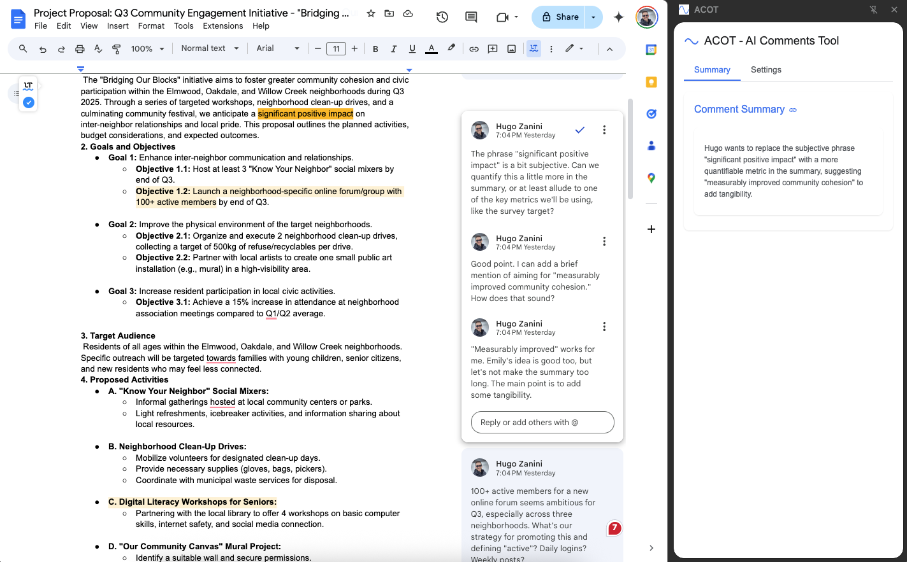
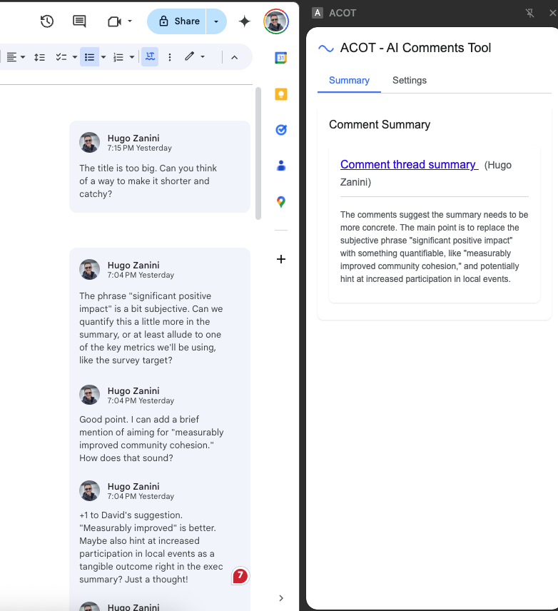
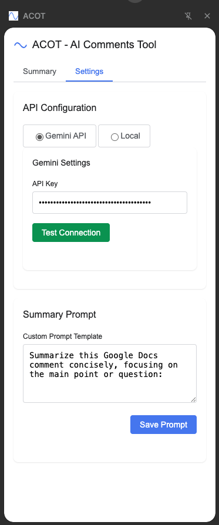

#  ACOT - AI Comments Tool for Google Docs

ACOT is a Chrome extension that enhances productivity in Google Docs by using AI to summarize comment threads. The extension provides instant AI-generated summaries in a convenient side panel.

## ✨ Features

- **Smart Comment Summaries**: Get concise AI-generated summaries of comment threads in Google Docs
- **Multiple AI Providers**:
  - Google Gemini API
  - Local LLM endpoints (Ollama)
  - OpenAI-compatible APIs
- **Customizable**: Edit prompts to control how comments are summarized
- **Easy-to-use**: Simple interface with one-click access from Chrome toolbar

## 📥 Installation

1. Download the latest release [here](https://github.com/hugozanini/acot/releases/latest)
2. Extract the ZIP file to a folder on your computer
3. Open Chrome and navigate to `chrome://extensions/`
4. Enable "Developer mode" (toggle in the top-right corner)
5. Click "Load unpacked" and select the extracted folder
6. The ACOT icon should now appear in your Chrome toolbar

## ⚙️ Setting Up Your Gemini API Key (Free)

Before using ACOT with Gemini, you'll need to get a free API key:

1. Visit [Google AI Studio](https://makersuite.google.com/app/apikey)
2. Sign in with your Google account
3. Click on "Get API key" or "Create API key"
4. Copy your new API key for use in ACOT

> **Note**: Google provides free usage of Gemini API (with limits). For most comment summarization needs, you'll likely stay within the free tier.

## 🚀 Getting Started

1. **Configure ACOT**:
   - Click the ACOT icon in your Chrome toolbar to open the side panel
   - Go to the "Settings" tab
   - Choose "Gemini API" as your provider
   - Paste your Gemini API key in the field
   - Click "Test Connection"
   - Select your preferred model (Gemini 1.5 Flash is recommended)
   - Save your configuration

2. **Using ACOT**:
   - Open any Google Docs document that contains comments
   - Simply click on any comment thread
   - View the AI-generated summary in the ACOT side panel
   - For long comment threads, the summary will highlight key points and questions

## 🔄 Alternative Setup: Local LLM

If you prefer to use your own local Large Language Model:

1. Set up [Ollama](https://ollama.ai/) on your computer
2. Run a model like Llama 3 locally
3. In ACOT settings, choose "Local" as your provider
4. Enter the endpoint (typically `http://localhost:11434`)
5. Test the connection and save

## 🛠️ Development

1. Clone the repository: `git clone https://github.com/hugozanini/acot.git`
2. Make your changes
3. Load the unpacked extension in Chrome for testing

## 📄 License

MIT
